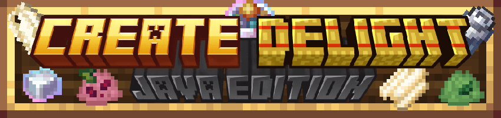
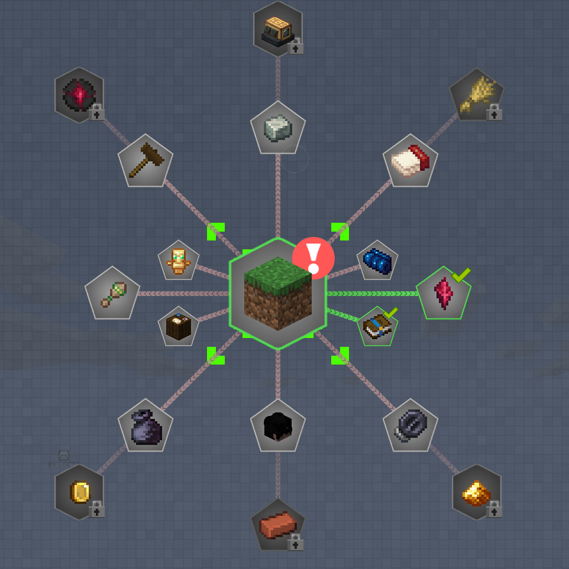
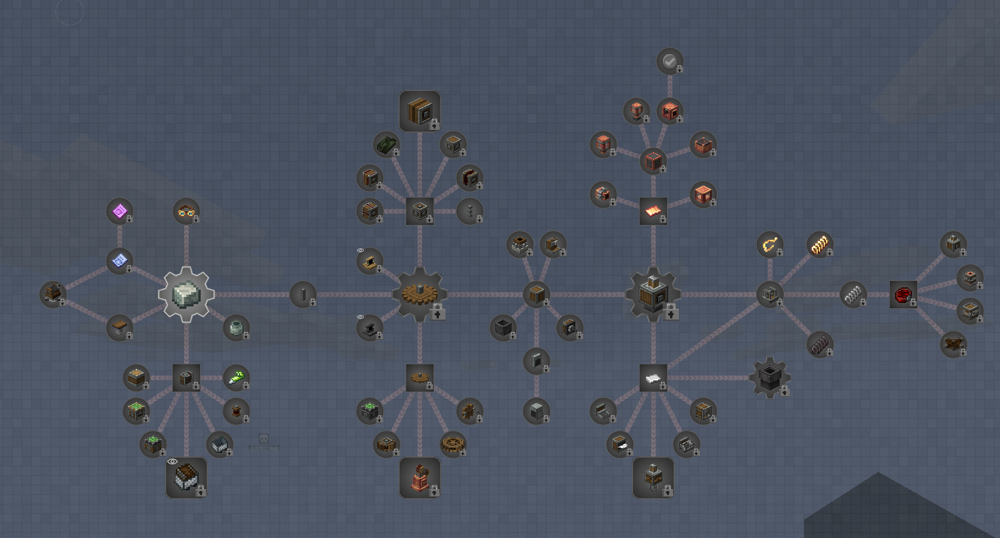
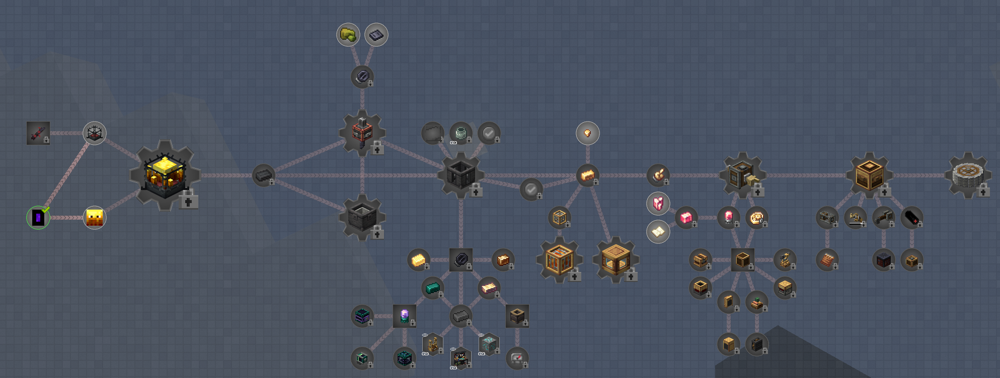
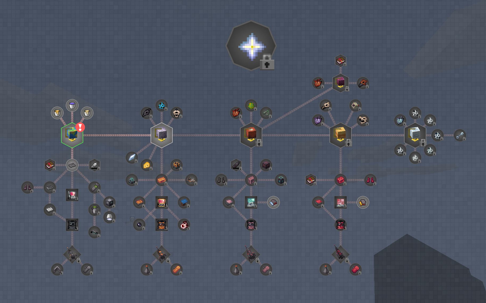

# 机械动力：齿轮盛宴
A Minecraft 1.20.1 Forge Create & Farmer's Delight modpack

<!-- PROJECT SHIELDS -->

![Version][version-shield]
[![Contributors][contributors-shield]][contributors-url]
[![Forks][forks-shield]][forks-url]
[![Stargazers][stars-shield]][stars-url]
[![Issues][issues-shield]][issues-url]
![Community1][qq-shield1]
[![MIT License][license-shield]][license-url]

<!-- PROJECT LOGO -->

 

  
  
   
  
  
  

  <h3 align="center">大型深度魔改向1.20.1Forge机械动力整合包</h3>
  

    整合包反馈交流群：856762964
     
    <a href="https://github.com/Jasons-impart/Create-Delight-Remake/actions"><strong>在GitHub上下载整合包最新测试版 »</strong></a>
     
    <a href="https://www.curseforge.com/minecraft/modpacks/create-delight-remake"><strong>在Curseorge上下载整合包最新测试版 »</strong></a>
     
     
    <a href="https://b23.tv/BV1zvNozWECh">观看宣传视频</a>
    .
    <a href="https://xr5r5e86lk.feishu.cn/docx/LE9ud6DgXoBaQhxowJucOQVqnWb">信息汇总文档</a>
    ·
    <a href="https://github.com/Jasons-impart/Create-Delight-Remake/issues">报告Bug</a>
    ·
    <a href="https://github.com/Jasons-impart/Create-Delight-Remake/issues">提出新特性</a>
  

> [!IMPORTANT]
> 整合包仍在**加急开发中**！如果你遇到任何问题，请为我们[反馈问题](https://xr5r5e86lk.feishu.cn/share/base/form/shrcnIDUxvX4oOvWSQaddJUht9b)！感激不尽！
> PS：目前CF上1201最新版仍不可下载，请使用QQ或quark网盘进行下载

欢迎来到齿轮盛宴的世界。

本整合包由超级工程师SSWTLZZ69和超级大厨JasonQ以及自动化大神wanquanw联合开发

在这里你将体验到搭建产线的乐趣

也能体验到沉浸式做菜的欢乐

更能体验到丰富的世界之旅，怪物、美景层出不穷，美不胜收

愿齿轮盛宴能给你带来盛宴一般的感受

---
 
## 目录

- [介绍](#介绍)
  - [核心模组](#核心模组)
  - [详尽指引](#详尽指引)
  - [深度魔改](#深度魔改)
- [上手指南](#上手指南)
  - [配置要求](#配置要求)
  - [安装步骤](#安装步骤)
- [未来计划](#未来计划)
- [社区支持](#社区支持)
  - [Discord](#discord)
  - [QQ](#qq)
- [开发团队](#开发团队)
- [支持我们](#支持我们)
- [特别鸣谢](#特别鸣谢)

---

## 介绍

  

这款以 **_机械动力_** 为核心的大型深度魔改整合包，在 Minecraft Forge 1.20.1 版本上运行！  

魔改了**超 5000+配方**

机械动力：齿轮盛宴 将各种 ***机械动力***、***农夫乐事***、***Ad_Astra***、***Alex洞穴***深度融合，创造出一个值得探索与建造的奇妙世界！

### 核心模组
#### 科技
- [机械动力](https://www.curseforge.com/minecraft/mc-mods/create)及其附属
- [应用能源2](https://www.curseforge.com/minecraft/mc-mods/applied-energistics-2)及其附属
#### 农业
- [农夫乐事](https://www.curseforge.com/minecraft/mc-mods/farmers-delight)及其附属
- [节气](https://www.curseforge.com/minecraft/mc-mods/ecliptic-seasons)
- [Quality Food](https://www.curseforge.com/minecraft/mc-mods/quality-food)
- [妖怪们的归家](https://www.curseforge.com/minecraft/mc-mods/youkais-homecoming)
- [那不勒斯风味](https://www.curseforge.com/minecraft/mc-mods/neapolitan)
#### 战斗
- [怪物增强](https://www.curseforge.com/minecraft/mc-mods/improved-mobs)
- [Tetra](https://www.curseforge.com/minecraft/mc-mods/tetra)及其附属
- [Better Combat](https://www.curseforge.com/minecraft/mc-mods/better-combat-by-daedelus)

### 详尽指引

  

  
### 深度魔改

  

1. **全新定制配方** - 专为农夫乐事模组设计！
2. **多维世界探索** - 各种奇异、美丽甚至怪诞的维度等待发现
3. **自制物品系统** - 包含数十种**精美纹理**的自定义物品
4. **近乎完整的机械动力生态** - 包含全套扩展模组
5. **惊艳的世界生成** - 令人惊叹的地形与结构
6. **村庄与建筑革新** - 全面改造的村庄、建筑和传送门
7. **内置光影与资源包** - 开箱即用的视觉增强
8. **500+详细任务** - 手把手引导游戏进程
10. **150+高质量模组** - 精心挑选的游戏扩展

熟悉机械动力相关模组的玩家可以快速上手，但请注意，这是一个**深度魔改**的整合包（使用[KubeJS](https://www.curseforge.com/minecraft/mc-mods/kubejs)），不仅更改了**5000+**配方，还添加了巨量的**原创**材料，已有的机制也进行了**大幅魔改**。你熟悉的玩法可能需要重新适应。不要依赖惯性思维，迎接新的挑战吧！

## 上手指南

  

### 配置要求

- **最低内存：***5G*****
- **推荐内存：***6G-8G*****  
  本模组包经过深度优化，确保持续流畅的游戏体验，并将不断进行性能改进。

### 安装步骤

- 测试版安装：
  - 下载本整合包的Release版zip文件（在Github上直接下载，亦可加群或者使用[网盘链接](https://pan.quark.cn/s/5100fa468f4b#/list/share)获取）。
  -  使用支持Curseforge整合包格式的启动器（例如HMCL）安装该文件。
  -  **启动游戏**

---

## 未来计划

  

- 持续修复漏洞
- 增加更多华丽/强力的tetra武器
- 加入更多可探险内容及BOSS挑战
- 实现更真实的食物制作流程
- 构建平衡的经济系统
- 设计自动化量产挑战任务

---

## 社区支持

### Discord

  

- 参与国际社区讨论！
- 随时向我们反馈意见！

### QQ

  

- 参与中文社区讨论！
- 随时向我们反馈意见！

---

## 支持我们

  

您的支持是项目持续发展的动力！无论金额大小，每笔捐赠都将帮助我们：

- 保持项目持续运行
- 不断提升模组包质量
- 开发更多精彩内容  
  感谢您的慷慨贡献！

---

## 开发团队

  

**特别鸣谢参与本项目的所有成员（排名不分先后）**

- **其余成员**

| 成员          | 贡献       |
| ------------- | ---------- |
| ikoi03        | ***美工*** |
| Maruyama_Ayaa | ***任务书编写*** |
| XinJinIris    | ***任务书编写*** |
| 史莱姆li       | ***提供工业平台及管道开口代码*** |
| Qi-Month      | ***提供开发者模式代码*** |

---

## 特别鸣谢
> _每一位从大一到已步入职场的团队成员在繁忙学业与工作中抽出时间参与其中，感谢你们的付出！_

---

<!-- links -->
[contributors-shield]: https://img.shields.io/github/contributors/Jasons-impart/Create-Delight-Remake.svg?style=flat-square
[contributors-url]: https://github.com/Jasons-impart/Create-Delight-Remake/graphs/contributors
[forks-shield]: https://img.shields.io/github/forks/Jasons-impart/Create-Delight-Remake.svg?style=flat-square
[forks-url]: https://github.com/Jasons-impart/Create-Delight-Remake/network/members
[stars-shield]: https://img.shields.io/github/stars/Jasons-impart/Create-Delight-Remake.svg?style=flat-square
[stars-url]: https://github.com/Jasons-impart/Create-Delight-Remake/stargazers
[issues-shield]: https://img.shields.io/github/issues/Jasons-impart/Create-Delight-Remake.svg?style=flat-square
[issues-url]: https://img.shields.io/github/issues/Jasons-impart/Create-Delight-Remake.svg
[qq-shield1]:https://img.shields.io/badge/QQ1群-856762964-12B7F3?style=flat-square
[version-shield]:https://img.shields.io/badge/Version-V0.4.5.3-2CB3A8?style=flat-square
[license-shield]: https://img.shields.io/github/license/JasdewStarfield/Path-of-Truth.svg?style=flat-square
[license-url]: https://github.com/Jasons-impart/Create-Delight-Remake/blob/readmeupdate/LICENSE
