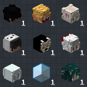

# 机械动力：齿轮盛宴
A Minecraft 1.20.1 Forge Create & Farmer's Delight modpack

<!-- PROJECT SHIELDS -->

![Version][version-shield]
[![Contributors][contributors-shield]][contributors-url]
[![Forks][forks-shield]][forks-url]
[![Stargazers][stars-shield]][stars-url]
[![Issues][issues-shield]][issues-url]
![Community1][qq-shield1]
[![MIT License][license-shield]][license-url]

<!-- PROJECT LOGO -->

 

  
  
   
  
  
  

  <h3 align="center">大型深度魔改向1.20.1Forge机械动力整合包</h3>
  

    整合包反馈交流群：856762964
     
    <a href="https://www.curseforge.com/minecraft/modpacks/create-leisurely-delight"><strong>在Curseforge上下载整合包正式版 »</strong></a>
     
     
    <a href="https://b23.tv/BV1zvNozWECh">观看宣传视频</a>
    ·
    <a href="https://github.com/Jasons-impart/Create-Delight-Remake/issues">报告Bug</a>
    ·
    <a href="https://github.com/Jasons-impart/Create-Delight-Remake/issues">提出新特性</a>
  

## 介绍

这款以 **_机械动力_** 为核心的休闲模组包，在 Minecraft Forge 1.20.1 版本上运行！  
魔改了**超 5000+配方**。  
机械动力：齿轮盛宴 将各种 ***机械动力*** 和 ***嘎嘎*** 融合，创造出一个值得探索与建造的奇妙世界！

---

## 特点

- **5000+魔改配方** - 深度定制的合成系统
- **完善的任务手册** - 包含详细引导说明
- **200+精选模组** - 包含大量扩展内容

---

### 核心亮点（***咕咕嘎嘎***）

1. **全新定制配方** - 专为农夫乐事模组设计！
2. **多维世界探索** - 各种奇异、美丽甚至怪诞的维度等待发现
3. **自制物品系统** - 包含数十种**精美纹理**的自定义物品
4. **近乎完整的机械动力生态** - 包含全套扩展模组
5. **惊艳的世界生成** - 令人惊叹的地形与结构
6. **村庄与建筑革新** - 全面改造的村庄、建筑和传送门
7. **内置光影与资源包** - 开箱即用的视觉增强
8. **500+详细任务** - 手把手引导游戏进程
9. **极致性能优化** - 仅需 ***咕咕嘎嘎*** 内存即可流畅运行
10. **150+高质量模组** - 精心挑选的游戏扩展

---

## 配置要求

- **最低内存：***咕咕嘎嘎*****
- **推荐内存：***咕咕嘎嘎*****  
  本模组包经过深度优化，确保持续流畅的游戏体验，并将不断进行性能改进。

---

## 未来计划***咕咕嘎嘎***

- 持续修复漏洞
- 新增自定义装备武器系统
- 加入更强力的敌人
- 实现更真实的食物制作流程
- 构建平衡的经济系统
- 设计自动化量产挑战任务

---

## 社区支持

### Discord 反馈

  
[点击加入 Discord](https://discord.gg/VjZKDnCT) 随时向我们反馈意见！

### QQ 交流群

  
[点击加入 QQ 群](https://qm.qq.com/q/ajPFnOx65a) 参与中文社区讨论！

---

## 支持我们

  
[点击支持项目](https://afdian.com/a/hk11238981)  
您的支持是项目持续发展的动力！无论金额大小，每笔捐赠都将帮助我们：

- 保持项目持续运行
- 不断提升模组包质量
- 开发更多精彩内容  
  感谢您的慷慨贡献！

---

## 开发团队***咕咕嘎嘎***

  
**特别鸣谢参与本项目的所有成员（排名不分先后）**

| 成员          | 贡献       |
| ------------- | ---------- |
| hk11238981    | ***咕咕嘎嘎*** |
| nanchuan211   | ***咕咕嘎嘎*** |
| LuJiChi       | ***咕咕嘎嘎*** |
| mi_xiao_bao   | ***咕咕嘎嘎*** |
| LightLeaves   | ***咕咕嘎嘎*** |
| ikoi03        | ***咕咕嘎嘎*** |
| C_Pearl       | ***咕咕嘎嘎*** |
| zhongxiaoli   | ***咕咕嘎嘎*** |
| Maruyama_Ayaa | ***咕咕嘎嘎*** |
| XinJinIris    | ***咕咕嘎嘎*** |
| cawyyds       | ***咕咕嘎嘎*** |
| SSWTLZZ       | ***咕咕嘎嘎*** |
| JIAFALSEDREAM | ***咕咕嘎嘎*** |
| AzureCrab     | ***咕咕嘎嘎*** |

> _每一位从大一到已步入职场的团队成员在繁忙学业与工作中抽出时间参与其中，感谢你们的付出！_

<!-- links -->
[contributors-shield]: https://img.shields.io/github/contributors/Jasons-impart/Create-Delight-Remake.svg?style=flat-square
[contributors-url]: https://github.com/Jasons-impart/Create-Delight-Remake/graphs/contributors
[forks-shield]: https://img.shields.io/github/forks/Jasons-impart/Create-Delight-Remake.svg?style=flat-square
[forks-url]: https://github.com/Jasons-impart/Create-Delight-Remake/network/members
[stars-shield]: https://img.shields.io/github/stars/Jasons-impart/Create-Delight-Remake.svg?style=flat-square
[stars-url]: https://github.com/Jasons-impart/Create-Delight-Remake/stargazers
[issues-shield]: https://img.shields.io/github/issues/Jasons-impart/Create-Delight-Remake.svg?style=flat-square
[issues-url]: https://img.shields.io/github/issues/Jasons-impart/Create-Delight-Remake.svg
[qq-shield1]:https://img.shields.io/badge/QQ1群-856762964-12B7F3?style=flat-square
[version-shield]:https://img.shields.io/badge/Version-V0.4.5-2CB3A8?style=flat-square
[license-shield]: https://img.shields.io/github/license/JasdewStarfield/Path-of-Truth.svg?style=flat-square
[license-url]: https://github.com/Jasons-impart/Create-Delight-Remake/blob/readmeupdate/LICENSE