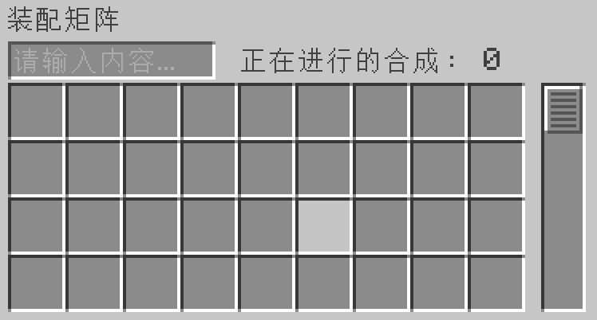

---
navigation:
    parent: epp_intro/epp_intro-index.md
    title: 装配矩阵
    icon: expatternprovider:assembler_matrix_frame
categories:
- extended devices
item_ids:
- expatternprovider:assembler_matrix_frame
- expatternprovider:assembler_matrix_wall
- expatternprovider:assembler_matrix_pattern
- expatternprovider:assembler_matrix_crafter
- expatternprovider:assembler_matrix_speed
---

# 装配矩阵

<Row>
<BlockImage id="expatternprovider:assembler_matrix_frame" p:formed="true" p:powered="true" scale="5"></BlockImage>
<BlockImage id="expatternprovider:assembler_matrix_wall" scale="5"></BlockImage>
<BlockImage id="expatternprovider:assembler_matrix_pattern" scale="5"></BlockImage>
<BlockImage id="expatternprovider:assembler_matrix_crafter" scale="5"></BlockImage>
<BlockImage id="expatternprovider:assembler_matrix_speed" scale="5"></BlockImage>
</Row>

装配矩阵是一个多方快结构。它是<ItemLink id="ae2:molecular_assembler" /> 和 <ItemLink id="ae2:pattern_provider" />的结合。它可以同时处理大量的合成请求（当你网络中有足时够的<ItemLink id="ae2:crafting_accelerator" />时）并为你节省大量的频道占用。

## 结构

<GameScene zoom="3" background="transparent" interactive={true}>
  <ImportStructure src="../structure/assembler_matrix.snbt"></ImportStructure>
</GameScene>

装配矩阵为矩形结构，大小在3x3x3与7x7x7之间。
- 边由装配矩阵框架组成。
- 面由装配矩阵外壳组成。
- 内部由样板核心/合成核心/速度核心组成。

一个有效的装配矩阵必须至少包含一个样板核心和装配核心。
内部必须是完全填满的，不能存在空心。
当装配矩阵正确摆放并通电后，装配矩阵框架上的线条将会变为蓝色。

## 装配矩阵核心

有三种不同的装配矩阵核心。

- 装配矩阵样板核心

装配矩阵只能从这之中读取样板，每个样板核心提供36个样板槽位。

- 装配矩阵合成核心

装配矩阵接受到合成请求后会将任务分配给合成核心，每个合成核心可以同时运行8个合成作业。

- 装配矩阵速度核心

它相当于是装配矩阵的<ItemLink id="ae2:speed_card" />。5个速度核心即可以使装配矩阵以最大速度运行。
安装5个以上的速度核心不会有额外的速度提升。

## GUI

右键单击激活的装配矩阵打开它的GUI。

你可以在其中放置和搜索样板，并查看它正在运行多少个合成作业。
